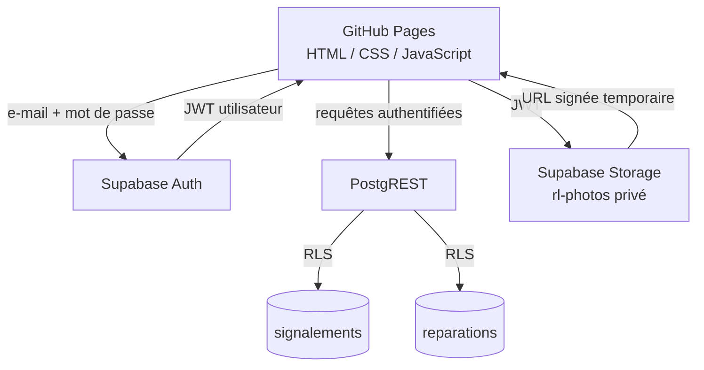

# 🏫 Respect des Lieux

> Application web de suivi des dégradations, incidents matériels et actions de réparation au sein d’un établissement scolaire.

[](https://darksathili-jpg.github.io/respect-des-lieux/)


---

## Présentation

**Respect des Lieux** est une application web destinée à faciliter le suivi des signalements concernant les locaux et équipements d’un établissement scolaire.

Elle permet de centraliser, dans une interface unique :

- les signalements ;
- leur localisation ;
- leur niveau de gravité ;
- les personnes ou élèves concernés lorsque cela est nécessaire ;
- les photographies associées ;
- l’état d’avancement du traitement ;
- les mesures prises ;
- les actions de réparation ;
- la clôture et l’historique des dossiers.

L’objectif est de disposer d’un outil simple, lisible et utilisable depuis un navigateur, sans installation d’un logiciel spécifique sur les postes de l’établissement.

> [!IMPORTANT]
> L’application peut contenir des informations relatives à des élèves ou à des situations internes à l’établissement. Son accès doit donc être strictement réservé aux personnels autorisés et son déploiement doit respecter les règles internes de l’établissement ainsi que les obligations applicables à la protection des données.

---

## 🌐 Application en ligne

**Version publiée :**

https://darksathili-jpg.github.io/respect-des-lieux/

L’application est hébergée sur **GitHub Pages** tandis que les données sont stockées et protégées avec **Supabase**.

---

## ✨ Fonctionnalités principales

### Signalements

L’application permet notamment de :

- créer un nouveau signalement ;
- attribuer un numéro de suivi ;
- enregistrer la date et l’heure ;
- préciser le lieu ;
- catégoriser le type de problème ;
- indiquer le niveau de gravité ;
- renseigner l’auteur du signalement ;
- ajouter une description détaillée ;
- associer, lorsque cela est nécessaire, un élève et une classe ;
- indiquer les informations utiles liées à la famille ;
- joindre des photographies ;
- suivre le statut du dossier.

### Réparations et mesures prises

Un signalement peut être complété par des informations de suivi :

- mesure mise en œuvre ;
- référent ;
- date de début ;
- durée ;
- notes complémentaires ;
- date de clôture ;
- état d’avancement.

### Consultation

L’interface permet de retrouver les signalements enregistrés et de suivre leur évolution depuis un navigateur.

---

# 🔐 Sécurité — évolution V4 / V4.1

La sécurité de l’application a fait l’objet d’une refonte importante.

Les premières versions reposaient essentiellement sur l’accès direct à Supabase depuis le navigateur. La version actuelle ajoute une véritable couche d’authentification et de contrôle des accès.

## Authentification Supabase

L’accès aux données nécessite désormais une authentification par :

- adresse e-mail ;
- mot de passe ;
- session Supabase authentifiée.

Il n’existe volontairement **aucun bouton public de création de compte dans l’application**.

Les comptes autorisés sont créés ou invités par l’administrateur du projet Supabase.

### Création d’un compte

Le fonctionnement prévu est :

```text
Administrateur Supabase
        │
        ├── invite une adresse e-mail autorisée
        │
        ▼
Utilisateur
        │
        ├── reçoit le message d’invitation
        ├── ouvre le lien sécurisé
        ├── choisit son mot de passe
        │
        ▼
Accès à Respect des Lieux
```

La **V4.1** détecte automatiquement les liens d’invitation Supabase et affiche un écran permettant à l’utilisateur de définir son mot de passe.

---

## Row Level Security — RLS

Les tables :

```text
public.signalements
public.reparations
```

utilisent désormais **Row Level Security**.

Les opérations suivantes sont autorisées uniquement au rôle Supabase :

```text
authenticated
```

Les politiques couvrent :

| Table | SELECT | INSERT | UPDATE | DELETE |
|---|:---:|:---:|:---:|:---:|
| `signalements` | ✅ | ✅ | ✅ | ✅ |
| `reparations` | ✅ | ✅ | ✅ | ✅ |

Un utilisateur non authentifié ne doit donc pas pouvoir lire directement les données via l’API REST publique.

---

## 📷 Photographies protégées

Le bucket Supabase Storage :

```text
rl-photos
```

est désormais configuré en :

```text
Private
```

Les photographies ne sont plus destinées à être exposées par des URL publiques permanentes.

L’application utilise des **URL signées temporaires**, générées uniquement pour un utilisateur disposant d’une session valide.

```text
Utilisateur authentifié
        │
        ▼
Demande de consultation
        │
        ▼
Supabase Storage privé
        │
        ▼
URL signée temporaire
        │
        ▼
Affichage de la photographie
```

---

## 🧹 Suppression du cache local sensible

Les anciennes versions pouvaient conserver localement certains éléments de suivi dans le navigateur.

La couche de sécurité actuelle supprime les clés sensibles historiques :

```text
rl3-sig
rl3-rep
rl3-queue
```

Les signalements et réparations ne doivent plus être volontairement conservés de manière persistante dans `localStorage`.

La session d’authentification est conservée dans `sessionStorage`.

> [!NOTE]
> La configuration publique du projet Supabase peut rester côté navigateur. Une clé **publishable / anon** est conçue pour être exposée dans une application cliente ; la protection réelle des données repose sur l’authentification, le JWT et les règles RLS.

---

## 🚫 Clés interdites dans le navigateur

Ne jamais placer dans le dépôt GitHub ou dans le JavaScript client :

```text
service_role
sb_secret_...
```

Seule une clé Supabase destinée à une application cliente doit être utilisée, par exemple une clé :

```text
sb_publishable_...
```

ou, selon la configuration du projet, la clé publique `anon`.

---

# 🏗️ Architecture



---

# 🧰 Technologies utilisées

| Technologie | Rôle |
|---|---|
| HTML5 | structure de l’interface |
| CSS3 | mise en page et identité visuelle |
| JavaScript | logique de l’application |
| Supabase Auth | authentification |
| Supabase PostgreSQL | stockage des données |
| Supabase PostgREST | accès sécurisé aux tables |
| Supabase Storage | stockage privé des photos |
| Row Level Security | contrôle des accès |
| GitHub Pages | hébergement du frontend |

L’architecture reste volontairement légère : aucun serveur applicatif traditionnel n’est nécessaire pour servir l’interface.

---

# 🚀 Installation

## 1. Créer un projet Supabase

Créer un projet depuis Supabase puis récupérer :

- **Project URL** ;
- la clé cliente **publishable** ou publique adaptée au frontend.

Ne jamais utiliser une clé `service_role` dans l’application.

---

## 2. Initialiser la base

Dans :

```text
Supabase
→ SQL Editor
→ New query
```

exécuter le script SQL sécurisé du projet.

Il crée ou configure notamment :

```text
signalements
reparations
rl-photos
```

et active les règles RLS nécessaires.

### Vérification RLS

La requête suivante doit retourner `true` pour les deux tables :

```sql
select
    schemaname,
    tablename,
    rowsecurity
from pg_catalog.pg_tables
where schemaname = 'public'
  and tablename in ('signalements', 'reparations')
order by tablename;
```

Résultat attendu :

```text
public | reparations  | true
public | signalements | true
```

---

## 3. Configurer Supabase Authentication

Dans :

```text
Authentication
→ Sign In / Providers
→ Email
```

le fournisseur Email doit rester activé.

Pour un déploiement contrôlé dans un établissement, les inscriptions publiques doivent être désactivées.

L’objectif est :

```text
création libre d'un compte : NON
invitation par l'administrateur : OUI
connexion d'un compte autorisé : OUI
```

---

## 4. Configurer les URL d’authentification

Dans :

```text
Authentication
→ URL Configuration
```

utiliser comme URL du site :

```text
https://darksathili-jpg.github.io/respect-des-lieux/
```

Ajouter également cette adresse dans les URL de redirection autorisées.

Cela permet aux invitations Supabase de revenir correctement vers l’application publiée.

---

## 5. Ajouter un utilisateur

Depuis :

```text
Authentication
→ Users
→ Add user
→ Send invitation
```

l’administrateur invite une adresse e-mail autorisée.

Avec la V4.1 :

1. l’utilisateur reçoit l’invitation ;
2. il clique sur le lien ;
3. l’application reconnaît le lien Supabase ;
4. elle affiche **Créer votre mot de passe** ;
5. l’utilisateur choisit son mot de passe ;
6. l’application s’ouvre avec une session authentifiée.

---

# 📦 Déploiement sur GitHub Pages

Le dépôt peut être publié directement avec GitHub Pages.

Le fichier de sécurité doit être chargé **après le script principal de l’application**.

Exemple en fin de `index.html` :

```html
<script src="./security-v4.js"></script>
</body>
</html>
```

Après modification du dépôt :

```text
Commit changes
→ attendre le déploiement GitHub Pages
→ Ctrl + F5 dans le navigateur
```

---

# ✅ Vérifications recommandées après déploiement

## Test 1 — accès non authentifié

Ouvrir l’application dans une fenêtre de navigation privée.

Résultat attendu :

- écran de connexion visible ;
- aucun signalement affiché ;
- aucune photographie accessible.

## Test 2 — utilisateur autorisé

Se connecter avec un compte créé ou invité dans Supabase.

Résultat attendu :

- connexion acceptée ;
- accès aux signalements ;
- création et modification fonctionnelles.

## Test 3 — stockage des photos

Vérifier dans Supabase :

```text
Storage
→ rl-photos
```

Le bucket doit rester :

```text
Private
```

## Test 4 — RLS

Dans Supabase, les deux tables doivent conserver :

```text
RLS = enabled
```

Ne jamais résoudre un problème d’accès en exécutant :

```sql
ALTER TABLE ... DISABLE ROW LEVEL SECURITY;
```

## Test 5 — navigateur

Dans les outils de développement :

```text
Application
→ Local Storage
```

les anciennes clés suivantes ne doivent plus contenir de données :

```text
rl3-sig
rl3-rep
rl3-queue
```

---

# 🛡️ Principes de sécurité retenus

La version actuelle s’appuie sur plusieurs niveaux complémentaires :

1. **aucune inscription publique depuis l’application** ;
2. **comptes contrôlés par l’administrateur Supabase** ;
3. **authentification par e-mail et mot de passe** ;
4. **JWT Supabase pour les appels API** ;
5. **RLS sur les tables métier** ;
6. **bucket photo privé** ;
7. **URL signées temporaires** ;
8. **absence de clé serveur secrète dans GitHub Pages** ;
9. **suppression du cache local persistant contenant les données sensibles**.

> [!WARNING]
> Cette architecture améliore fortement la sécurité technique de l’application, mais elle ne constitue pas à elle seule une validation juridique, réglementaire ou RGPD du traitement. Avant un usage réel avec des données nominatives d’élèves, les règles de l’établissement, la politique de conservation, les habilitations, l’information des personnes concernées et les exigences de protection des données doivent être examinées.

---

# 🔄 Évolutions récentes

## V4 — sécurisation Supabase

Principales améliorations :

- activation de Supabase Auth ;
- activation de RLS ;
- suppression des accès anonymes aux tables ;
- création de policies pour les utilisateurs authentifiés ;
- passage du bucket `rl-photos` en privé ;
- utilisation d’URL signées ;
- suppression du fallback Base64 des photos ;
- suppression du stockage local persistant des données sensibles ;
- utilisation du JWT utilisateur pour les requêtes REST.

## V4.1 — parcours d’invitation

Améliorations supplémentaires :

- détection des liens d’invitation Supabase ;
- récupération automatique de la session temporaire ;
- écran **Créer votre mot de passe** ;
- confirmation du mot de passe ;
- activation du compte depuis l’application ;
- nettoyage des jetons d’authentification présents dans l’URL ;
- prise en charge du flux de récupération de compte comme base pour une future fonction **Mot de passe oublié**.

---

# 🗺️ Pistes d’évolution

Plusieurs évolutions peuvent encore renforcer l’application :

- gestion de rôles distincts : administrateur, CPE, AED, lecture seule ;
- journal d’audit des modifications ;
- historique complet d’un signalement ;
- gestion des droits par établissement ou service ;
- politique de durée de conservation des données ;
- suppression automatique des photographies lors de la suppression d’un dossier ;
- procédure **Mot de passe oublié** complète ;
- export PDF sécurisé ;
- tableau de bord statistique ;
- tests automatisés de non-régression ;
- audit d’accessibilité ;
- amélioration de l’utilisation sur tablette.

---

# 🔧 Dépannage

## « Invalid login credentials »

Vérifier que :

- l’utilisateur existe dans `Authentication → Users` ;
- il a bien défini son mot de passe ;
- l’adresse e-mail saisie est correcte ;
- le compte n’a pas été supprimé.

## L’invitation ouvre `localhost:3000`

Vérifier :

```text
Authentication
→ URL Configuration
```

et remplacer l’URL locale par :

```text
https://darksathili-jpg.github.io/respect-des-lieux/
```

Puis envoyer une **nouvelle invitation**.

## « Tables introuvables »

Vérifier que :

- `signalements` existe dans le schéma `public` ;
- `reparations` existe dans le schéma `public` ;
- l’application pointe vers le bon projet Supabase ;
- le script SQL d’installation a bien été exécuté.

Ne pas désactiver RLS.

## Les photos ne s’affichent plus

Vérifier :

- que l’utilisateur est connecté ;
- que `rl-photos` existe ;
- que le bucket est privé ;
- que les policies Storage pour `authenticated` sont présentes.

---

# 👤 Projet

Application développée pour répondre à un besoin de suivi des signalements et de responsabilisation autour du respect des locaux au sein du **Lycée Antoine Watteau de Valenciennes**.

Le projet vise une interface :

- simple à prendre en main ;
- accessible depuis un navigateur ;
- adaptée à un usage quotidien ;
- structurée autour d’un suivi clair des incidents et de leur résolution.

---

# 📄 Licence et réutilisation

Avant toute diffusion ou réutilisation extérieure au projet, vérifier la licence associée au dépôt.

Si le dépôt doit être distribué comme logiciel libre, ajouter un fichier `LICENSE` explicite à la racine du projet.

---

## Respect des Lieux

**Signaler · Suivre · Réparer · Responsabiliser**

